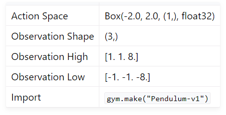
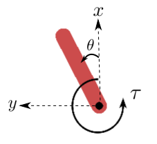
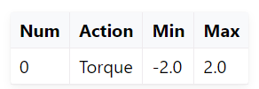
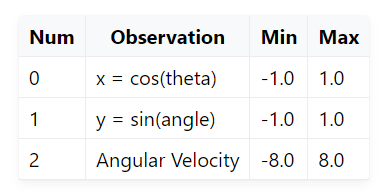

# Pendulum

[Document](https://gymnasium.farama.org/environments/classic_control/pendulum/)


## Impormation



### Description



`x-y` : 막대기 끝의 좌표

`theta` : 라디안 각도

`tau` : 반시계 방향의 양수

### action space

ndarray (1,) 



### oservation space

ndarray (3,)



### reward

r = -($theta^2$ + 0.1 * $theta$_$dt^2$ + 0.001 * $torque^2$)

$theta$는 [-pi, pi] 사이에서 정규화된 각도 ( 0은 수직 )

최소 보상은 -16.2736044, 최대 보상은 0

### starting state

랜덤한 각도 [-pi, pi]
랜덤한 각속도 [-1, 1]

### episode

200 time step

### arguments

`g` : 중력 가속도 ( default = 10.0)

```python
gym.make('Pendulum-v1', g=9.81)
```