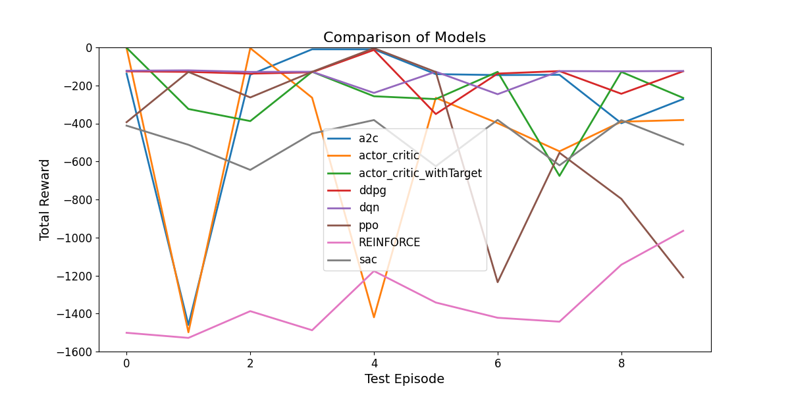

# Deep Reinforcement Learning

install anaconda [here](https://minukiki.github.io/other/Anaconda_install/)

python==3.11.9

```
pip install -r requirements.txt
```

If the gymnasium doesn't work.
[here](https://minukiki.github.io/ai/OpenaiGym/)

If you are using Anaconda env (recommended requirements)
```
conda env create -f environment.yml
```

## Grid world

1. Value Iteration
2. Policy Iteration
3. Monte Carlo
4. Sarsa
5. Q-learning

## Pendulum
1. Sarsa
2. Q-learning
3. DQN
4. Double DQN with PER
5. REINFORCE
6. Actor-Critic / 6-1. Actor-Critic with Target network
7. A2C
8. DDPG
9. PPO
10. SAC

## Results after 10 tests

